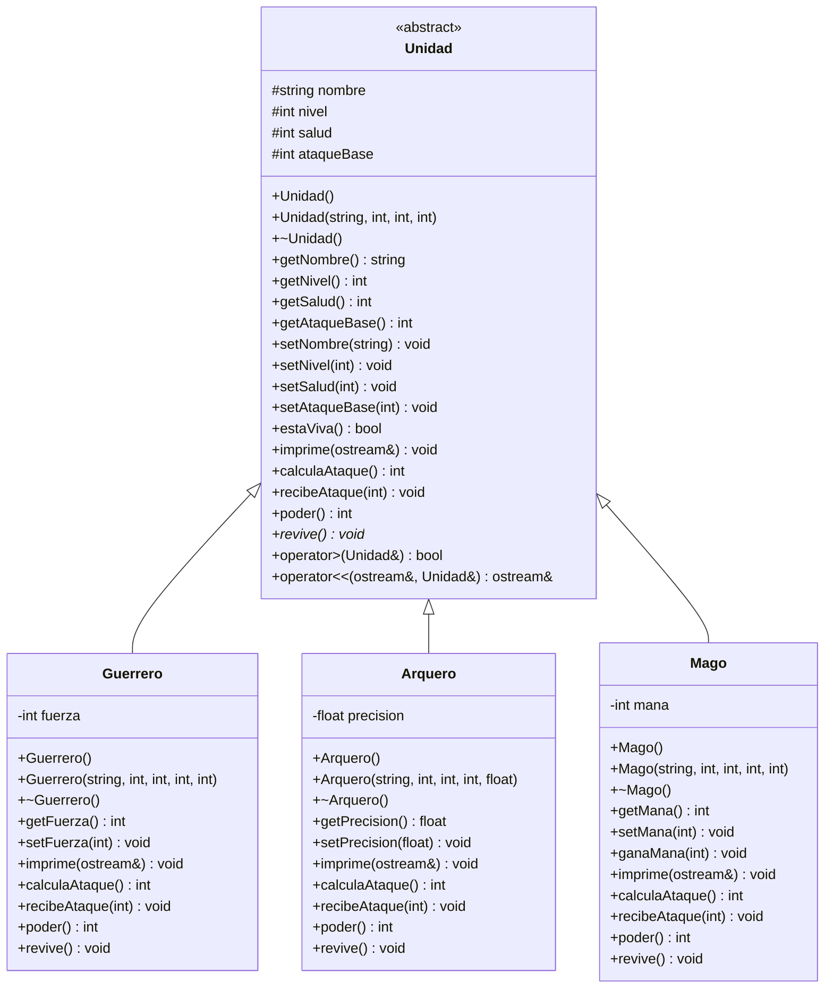

# Simulador de Batalla — Herencia, Polimorfismo y Sobrecarga de Operadores

Jerarquía con una clase base **abstracta** `Unidad` y tres clases derivadas: **Guerrero**, **Arquero** y **Mago**.
Cada una añade un atributo especializado y sobreescribe `imprime()`, `calculaAtaque()`, `recibeAtaque()`, `poder()` e implementa el método virtual puro `revive()`.

## Diagrama UML



---

## Polimorfismo en tiempo de ejecución

Todos los métodos que se sobreescriben están declarados **`virtual`** en `Unidad` y con **`override`** en las derivadas. En `exercise.cpp` se trabaja con un `vector<Unidad*>`: el compilador solo sabe que son `Unidad*`, pero en ejecución se ejecuta la versión del tipo real (`Guerrero`, `Arquero` o `Mago`). El destructor también es `virtual` para que `delete` libere correctamente.

`revive()` es **virtual puro** (`= 0`), por lo que **`Unidad` es abstracta**: no se pueden crear objetos de ella, solo apuntadores. En `main()` se dejó comentada la línea que lo intentaría, para mostrar que es un error de compilación.

---

## Clase base `Unidad` (abstracta)

| Método | Comportamiento |
|---|---|
| `imprime(ostream&)` | Escribe nombre, nivel, salud y ataque base en el flujo que reciba (por defecto `cout`). |
| `calculaAtaque()` | `ataqueBase + (nivel * 2) + aleatorio(0..5)`. |
| `recibeAtaque(danio)` | Resta el daño a la salud; nunca baja de 0. |
| `poder()` | `salud/2 + ataqueBase + nivel*2`. Cada derivada le suma su atributo especial. |
| `revive()` | **Virtual puro**, cada derivada lo implementa a su manera. |

---

## Clase `Guerrero` — atributo especial: `fuerza` (0–100)

- **`imprime()`** — reutiliza `Unidad::imprime()` y añade `[GUERRERO]` y la fuerza.
- **`calculaAtaque()`** — ataque base + `fuerza / 10`. Con fuerza ≥ 60 hay **25%** de *golpe contundente* (daño × 1.5).
- **`recibeAtaque(danio)`** — la fuerza actúa como armadura y resta `fuerza / 20`. Si es nivel 1 recibe **25% más** de daño. Al final llama a `revive()`.
- **`revive()` — Segundo aliento:** si la salud llega a 0 pero conserva **≥ 40 de fuerza**, se levanta con `20 + fuerza/10` de salud y **gasta 40 de fuerza**. Si no le alcanza, muere y se imprime el mensaje.
- **`poder()`** — `Unidad::poder() + fuerza/2`.

## Clase `Arquero` — atributo especial: `precision` (0.0–100.0)

- **`imprime()`** — añade `[ARQUERO]` y el porcentaje de precisión.
- **`calculaAtaque()`** — **tiro crítico** (× 1.75) con probabilidad `precision/2`; si no, 20% de fallar (daño ÷ 2).
- **`recibeAtaque(danio)`** — **esquiva** (daño ÷ 2) con probabilidad `precision/4`; de nivel 1 o 2 recibe **20% más**. Al final llama a `revive()`.
- **`revive()` — Salto evasivo:** si cae a 0 pero su precisión es **≥ 50%**, esquiva el golpe mortal y vuelve con 15 de salud, **gastando 35 de precisión**.
- **`poder()`** — `Unidad::poder() + precision/2`.

## Clase `Mago` — atributo especial: `mana` (0–100)

- **`imprime()`** — añade `[MAGO]` y el maná actual.
- **`calculaAtaque()`** — con 20 o más de maná, la probabilidad de lanzar un **hechizo fuerte** (daño × 2, cuesta 20 de maná) es igual a su valor de maná. Si no lo lanza gasta 5. Con menos de 10 de maná está agotado y su daño baja a la mitad.
- **`recibeAtaque(danio)`** — *escudo mágico* (cada activación gasta 10 de maná). Al final llama a `revive()`.

  | Condición | Daño recibido |
  |---|---|
  | nivel ≥ 4 y maná > 80 | 1/3 del daño |
  | nivel ≥ 3 y maná > 60 | 1/2 del daño |
  | maná > 30 | 3/4 del daño |
  | resto | daño completo |

- **`revive()` — Reencarnación:** si cae a 0 pero le quedan **≥ 40 de maná**, revive con 25 de salud y **gasta 40 de maná**.
- **`ganaMana(int)`** — recupera 30 de maná si derrota a un enemigo.
- **`poder()`** — `Unidad::poder() + mana/2`.

Como revivir cuesta 35–40 puntos del atributo especial, cada personaje solo puede usarlo **una o dos veces** y después muere de verdad.

---

## Sobrecarga de operadores

### `operator<<` (flujo de salida)

Se declara como función `friend` de `Unidad`:

```cpp
std::ostream& operator<<(std::ostream &os, const Unidad &u) {
    u.imprime(os);   // imprime() es virtual -> impresion polimorfica
    return os;
}
```

`operator<<` no puede ser virtual, así que **delega en `imprime()`, que sí lo es**. Así, `cout << *ejercito[i]` imprime el formato del tipo real del objeto. Además permite encadenar salida normal: `cout << "El mago es: " << *ejercito[2] << endl;`

### `operator>` (comparación de poder)

Método miembro que compara dos combatientes usando `poder()`, que también es virtual, de modo que cada clase aporta su atributo especial a la comparación:

```cpp
bool Unidad::operator>(const Unidad &otra) const {
    return this->poder() > otra.poder();
}
```

Se usa en `main()` para comparar por parejas y para buscar al combatiente más poderoso: `if (*ejercito[i] > *mejor) mejor = ejercito[i];`

---

## Qué hace `exercise.cpp`

1. Crea un `vector<Unidad*>` con un `Guerrero`, un `Arquero` y un `Mago` reservados con `new`.
2. Un `for` imprime a los tres usando `operator<<`.
3. Un doble `for` por rondas hace que cada combatiente ataque a los demás; después de cada ataque se imprime al personaje atacado.
4. Muestra el estado final (en pie / derrotado).
5. Prueba `operator<<` y `operator>` de forma explícita.
6. Libera la memoria con `delete` (destructor virtual).

## Compilación

```bash
g++ -std=c++11 -o simulador Unidad.cpp Guerrero.cpp Arquero.cpp Mago.cpp exercise.cpp
./simulador
```
